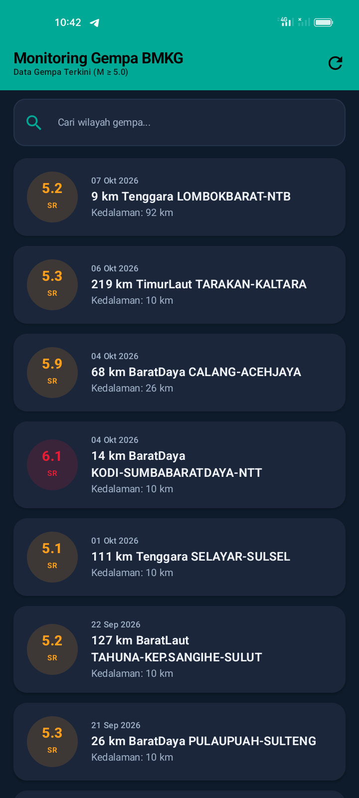

# Monitoring Gempa BMKG - Aplikasi Katalog dan Monitoring Gempa Terkini

Aplikasi mobile berbasis **Android (Jetpack Compose)** untuk katalog dan pemantauan gempa bumi terkini di Indonesia yang mengambil data secara dinamis dari **REST API Badan Meteorologi, Klimatologi, dan Geofisika (BMKG)**.

Proyek ini dikembangkan untuk memenuhi penugasan **Responsi Praktikum Pemrograman Mobile I (PAKET 1)** dengan menerapkan arsitektur **MVVM (Model-View-ViewModel)** murni dan standar modern Android development.

---

## 🔗 Informasi Pengumpulan & Tautan Penting

- **🌿 Branch Penugasan**: [`feat/responsi-gempa-bmkg`](https://github.com/Pancar-ws/MobileLab26-IFUnsoedMobile/tree/feat/responsi-gempa-bmkg)
- **🎥 Video Penjelasan Kode (YouTube)**: [https://youtu.be/vEdlnOR7JQ0](https://youtu.be/vEdlnOR7JQ0)

---

## 📱 Screenshots Tampilan Aplikasi


| Home Screen (Katalog & Pencarian) | Detail Screen (Parameter Lengkap) |
| :---: | :---: |
|  |  |

---

## ✨ Fitur Utama

1. **Monitoring Gempa Terkini**: Mengambil dan menampilkan data gempa bumi terkini (M ≥ 5.0) langsung dari REST API BMKG secara dinamis.
2. **State-Driven UI (Pola P5)**:
   - **Loading State**: Animasi indikator saat data sedang diambil dari server.
   - **Success State**: Daftar gempa ditampilkan menggunakan `LazyColumn` dengan visualisasi tingkat magnitudo (kartu berwarna responsif).
   - **Error State**: Pesan interaktif saat terjadi kegagalan jaringan beserta tombol *Coba Lagi* (*Retry*).
   - **Empty State**: Menampilkan pesan informatif jika pencarian wilayah tidak ditemukan.
3. **Pencarian Lokal Berdasarkan Wilayah**: Filter instan secara lokal di sisi klien berdasarkan nama wilayah gempa menggunakan `StateFlow` reaktif tanpa re-fetch ke API.
4. **Navigasi Multi-Screen (Maksimal 2 Screens)**:
   - **Home Screen**: Header TopAppBar, search bar interaktif, daftar gempa (`Tanggal`, `Magnitudo`, `Wilayah`).
   - **Detail Screen**: Rincian lengkap parameter gempa (`Tanggal`, `Jam`, `Coordinates`, `Magnitudo`, `Kedalaman`, `Wilayah`, `Potensi`, serta tombol kembali/back).
5. **Dukungan Material Design 3 & Dark/Light Theme**: Dukungan adaptif tema gelap dan terang dengan palet warna resmi pengamatan geofisika.

---

## 🏗️ Arsitektur Aplikasi (MVVM)

Aplikasi dibangun dengan arsitektur **MVVM (Model-View-ViewModel)** untuk menjaga pemisahan tanggung jawab (*Separation of Concerns*):

```
┌────────────────────────────────────────────────────────┐
│                   VIEW / COMPOSABLES                   │
│   HomeScreen, DetailScreen, Reusable UI Components    │
└───────────────────────────▲────────────────────────────┘
                            │ Collects StateFlow (UiState)
                            │ Triggers Events (Search, Refresh)
┌───────────────────────────┴────────────────────────────┐
│                       VIEWMODEL                        │
│                   GempaViewModel                       │
│     (StateFlow<UiState>, StateFlow<String> search)     │
└───────────────────────────▲────────────────────────────┘
                            │ Calls suspend functions
┌───────────────────────────┴────────────────────────────┐
│                      REPOSITORY                        │
│                   GempaRepository                      │
└───────────────────────────▲────────────────────────────┘
                            │ Fetches Data
┌───────────────────────────┴────────────────────────────┐
│                    REMOTE / NETWORK                    │
│          ApiClient (Retrofit + Converter-Gson)         │
│                    GempaApiService                     │
└───────────────────────────▲────────────────────────────┘
                            │ HTTP GET (JSON)
                    REST API BMKG
```

- **Data Model**: `GempaResponse`, `InfoGempa`, `Gempa` (data class dengan serialisasi Gson).
- **Remote / API**: `GempaApiService` mendefinisikan endpoint Retrofit, dan `ApiClient` sebagai singleton client.
- **Repository**: `GempaRepository` mengabstraksi pemanggilan API dari ViewModel.
- **ViewModel**: `GempaViewModel` mengelola `UiState` (Sealed Interface: `Loading`, `Success`, `Error`) via `StateFlow` dan menangani logika filter pencarian.
- **View**: Jetpack Compose Composable UI yang hanya bertugas me-render state tanpa memanggil API langsung.

---

## 🌐 Sumber Data & Endpoint API

- **Penyedia**: Badan Meteorologi, Klimatologi, dan Geofisika (BMKG)
- **Base URL**: `https://data.bmkg.go.id/`
- **Endpoint**: `/DataMKG/TEWS/gempaterkini.json`
- **Full URL**: `https://data.bmkg.go.id/DataMKG/TEWS/gempaterkini.json`
- **Struktur Response**: `Infogempa.gempa[]`
- **Atribut**: `Tanggal`, `Jam`, `Coordinates`, `Lintang`, `Bujur`, `Magnitude`, `Kedalaman`, `Wilayah`, `Potensi`.

---

## 🛠️ Persyaratan Teknis & Pemanfaatan Fitur Kotlin

| Persyaratan | Implementasi |
| :--- | :--- |
| **Kotlin Features** | • **Data Class**: Model data immutability (`Gempa`, `GempaResponse`).<br>• **Null Safety**: Menggunakan safe call `?.` dan elvis operator `?:` untuk handling data API.<br>• **Lambda**: Callback navigasi dan filter data collection.<br>• **Extension Functions**: `Gempa.getMagnitudeValue()` dan `Gempa.getMagnitudeCategory()`. |
| **User Interface** | Jetpack Compose, Material Design 3, `Scaffold`, `TopAppBar`, `LazyColumn` (tanpa library gambar pihak ketiga). |
| **Theme & Typography** | Modifikasi kustom di `Color.kt`, `Theme.kt` (Dark/Light ColorScheme), dan override typography di `Type.kt`. |
| **Library yang Digunakan** | • `Retrofit` & `converter-gson`<br>• `navigation-compose`<br>• `lifecycle-viewmodel-compose` |
| **Permission** | `android.permission.INTERNET` di `AndroidManifest.xml` |

---

## 📦 Lokasi File APK Debug

File APK Debug siap dipasang dan diuji secara offline:
```
app/build/outputs/apk/debug/app-debug.apk
```
Atau dapat dibangun ulang menggunakan perintah:
```bash
./gradlew assembleDebug
```